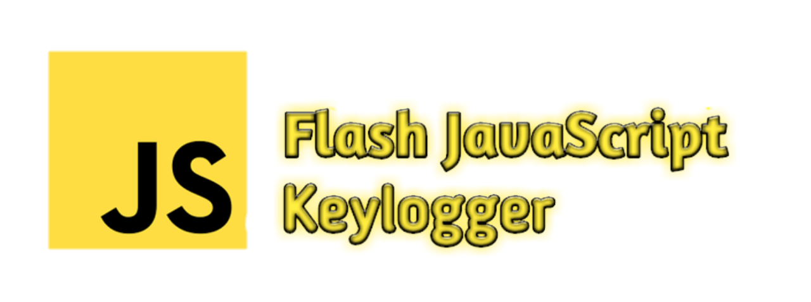

# :zap: Flash Keylogger
> Modern javascript keylogger with web panel

  

___

## :computer: Web panel:

  

## :telescope: Logging:
* Keylogger
* Cookies
* Location
* Remote IP
* User-Agents

## :satellite: Installation server files:
* Upload files from `server` directory to you server
* Change default username, password in flash.php
* Go to http://you.host/flash.php
* Click build
* Now inject script tag to other documents
